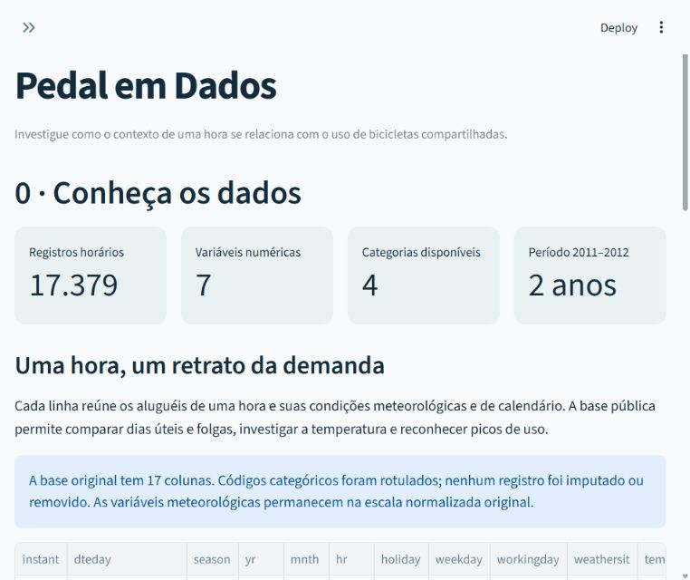
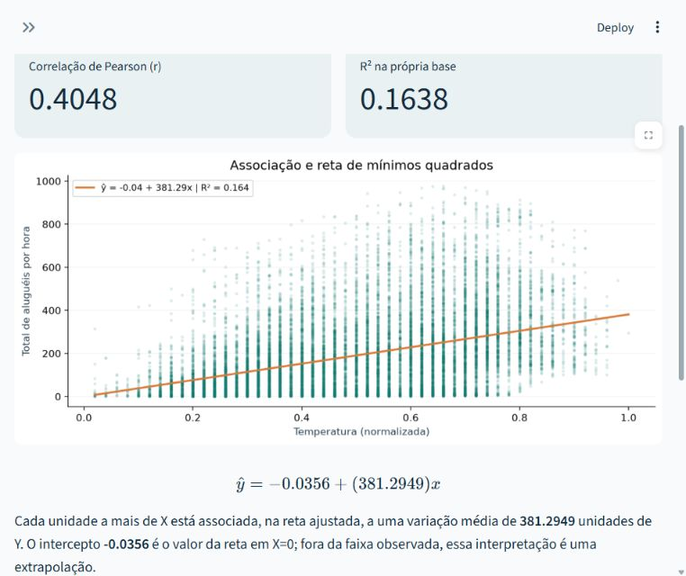

# Pedal em Dados — Laboratório Estatístico

Aplicação interativa em Python para explorar dados reais de aluguel de bicicletas, calcular estatísticas com uma biblioteca própria, simular fenômenos probabilísticos e interpretar regressões. Projeto acadêmico **individual**, baseado no conjunto Bike Sharing da UCI.

## Executar no Windows

Extraia o projeto, abra a pasta no VS Code ou no Explorador de Arquivos e abra um terminal **nessa pasta**, onde está `app.py`. O projeto foi validado no Windows com **Python 3.12.14** e as versões fixadas em `requirements.txt`.

Execute os comandos abaixo, um por vez, no PowerShell. A ativação do ambiente virtual é dispensável porque os comandos usam diretamente o Python desse ambiente.

```powershell
py -3.12 -m venv .venv
.\.venv\Scripts\python.exe -m pip install -r requirements.txt
.\.venv\Scripts\python.exe -m streamlit run app.py
```

O navegador abre a aplicação. Se isso não acontecer, acesse o endereço local informado pelo terminal, normalmente `http://localhost:8501`. Para encerrar, volte ao terminal e pressione `Ctrl+C`.

Para executar os testes:

```powershell
.\.venv\Scripts\python.exe -m pytest -q
```

Se o comando `py` não for encontrado, instale o Python 3.12 e reabra o terminal. Se tiver apenas outra versão do Python instalada, instale a versão indicada para manter o ambiente reproduzível.

## Identificação

| Campo | Informação |
|---|---|
| Estudante |Joao Victor Ramos Mascarenhas |
| Matrícula | 72650059 |


## Dados e pergunta do projeto

**Pergunta:** como a demanda por bicicletas varia e como se relaciona com condições ambientais e de calendário?

O arquivo `dados/dataset.csv` contém a versão horária `hour.csv`: **17.379 registros e 17 colunas**. A contagem corresponde ao arquivo utilizado; o cabeçalho da página UCI apresenta uma contagem diferente. Os registros se referem a 2011 e 2012 no sistema Capital Bikeshare. O CSV está incluído para permitir executar a aplicação sem baixar os dados novamente.

Fonte: [Bike Sharing — UCI Machine Learning Repository](https://archive.ics.uci.edu/dataset/275/bike+sharing+dataset). Referência: Fanaee-T, H. (2013). *Bike Sharing* [Dataset]. UCI. [DOI: 10.24432/C5W894](https://doi.org/10.24432/C5W894). Dados disponibilizados sob [CC BY 4.0](https://creativecommons.org/licenses/by/4.0/).

As sete variáveis numéricas analisadas são `temp`, `atemp`, `hum`, `windspeed`, `casual`, `registered` e `cnt`. A aplicação apresenta as categorias `clima`, `tipo_dia`, `ano` e `feriado`, derivadas dos códigos originais `weathersit`, `workingday`, `yr` e `holiday`. Códigos de calendário e identificadores não são tratados como medidas contínuas apenas porque aparecem como números no CSV. As 17 colunas são as do CSV original; os quatro rótulos são acrescentados apenas durante o carregamento.

`temp`, `atemp`, `hum` e `windspeed` estão normalizadas na fonte. O projeto preserva essas escalas: divergências entre a página UCI e o arquivo de descrição original impedem uma conversão de temperatura inequívoca. Pelo mesmo motivo, `season` é preservada como código original, sem rótulos de estação inferidos. `casual` e `registered` são contagens de aluguéis por tipo de usuário, e `cnt` é o total de aluguéis; esses valores não representam pessoas únicas. Confira a unidade e o rótulo mostrados pela aplicação antes de interpretar um valor.

## Os sete módulos

| Módulo | O que explorar |
|---|---|
| 0 — Dados reais | Fonte, dimensões, qualidade, tipos de variáveis e amostra dos registros. |
| 1 — Núcleo estatístico próprio | Média, mediana, moda, amplitude, variâncias, desvios, quantis, coeficiente de variação, covariância e Pearson implementados em `minhastats`. |
| 2 — Estatística descritiva | Escolha de variável, tabela de frequências, classes para variáveis numéricas, histogramas, boxplots, categorias e sinalização de valores extremos por IQR. |
| 3 — Probabilidade e simulação | Lei dos Grandes Números com moeda e Teorema Central do Limite com amostras do dataset; controles de repetições, tamanho amostral e semente. |
| 4 — Distribuições teóricas | Histograma de densidade comparado com Normal, Uniforme ou Exponencial, com parâmetros estimados dos dados e comentários sobre adequação. |
| 5 — Correlação e regressão | Escolha de X e Y, dispersão, Pearson, reta por mínimos quadrados, equação, R² e previsão interativa. |
| 6 — Descobertas | Três conclusões sustentadas por resultados e gráficos, com limites de interpretação. |

O núcleo matemático fica separado da interface. NumPy, pandas e SciPy apoiam a manipulação de dados e as referências de validação; as medidas apresentadas como cálculo próprio vêm de `minhastats`.

## Capturas da interface

**Módulo 0 — apresentação dos dados e da origem da base.**



**Módulo 5 — exploração de correlação, regressão e previsão.**



As capturas dos sete módulos estão na pasta `docs`.

## Arquivos principais

```text
app.py                       interface interativa
minhastats.py                funções estatísticas próprias
dados/dataset.csv            dados reais incluídos
requirements.txt             dependências
test_*.py                    testes do núcleo, dos dados e da aplicação
RELATORIO.md                  metodologia, validação e descobertas
entrega.json                 identificação e links para a entrega
scripts/gerar_resultados.py   atualização dos resultados documentados
scripts/gerar_pdf.py          geração do documento de entrega
docs/                        evidências e materiais de apoio
```

## Validação executada

A suíte completa passou em **351 testes**, em 34,16 segundos na execução de verificação: 320 do núcleo estatístico, 18 dos dados e 13 da aplicação. O ambiente foi Windows com Python 3.12.14 e as dependências de `requirements.txt`. O tempo é o registro dessa execução e pode variar em outros computadores.

O script de resultados também aprovou **209 comparações numéricas** com NumPy/SciPy. A maior diferença absoluta registrada foi aproximadamente **7,275958 × 10⁻¹²**, dentro das tolerâncias `rtol=1e-9` e `atol=1e-10`.

Consulte [o resumo dos testes](docs/TESTES.md), [a tabela de validação](docs/validacao.csv) e [o relatório](RELATORIO.md). Os arquivos `test_minhastats.py`, `test_dados.py` e `test_app.py` detalham os cenários, incluindo casos como amostras pequenas, variáveis constantes, dados corrompidos e interação com os sete módulos.

## Atualizar resultados e gerar o PDF

Para atualizar os resultados e o documento de entrega após preencher `entrega.json`:

```powershell
.\.venv\Scripts\python.exe scripts/gerar_resultados.py
.\.venv\Scripts\python.exe scripts/gerar_pdf.py
```

`docs/descobertas.json` guarda os resultados das descobertas. As imagens de cada módulo são organizadas em `docs/modulo_0.png` a `docs/modulo_6.png`. Confira os resultados locais e o relatório antes de entregar; alterar o código ou os dados pode mudar os números e as evidências.

O pacote inclui [SISTEMATIZACAO_MEC_PedalEmDados_MODELO.pdf](SISTEMATIZACAO_MEC_PedalEmDados_MODELO.pdf), uma prévia com campos para preenchimento. **Esse modelo ainda não deve ser enviado ao sistema da disciplina.** Para recriá-lo antes de preencher seus dados:

```powershell
.\.venv\Scripts\python.exe scripts/gerar_pdf.py --modelo
```

