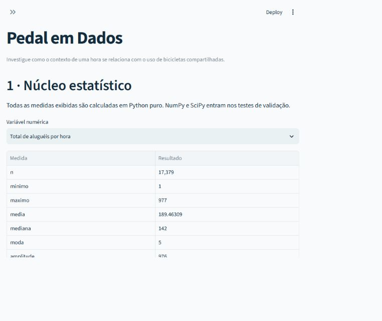
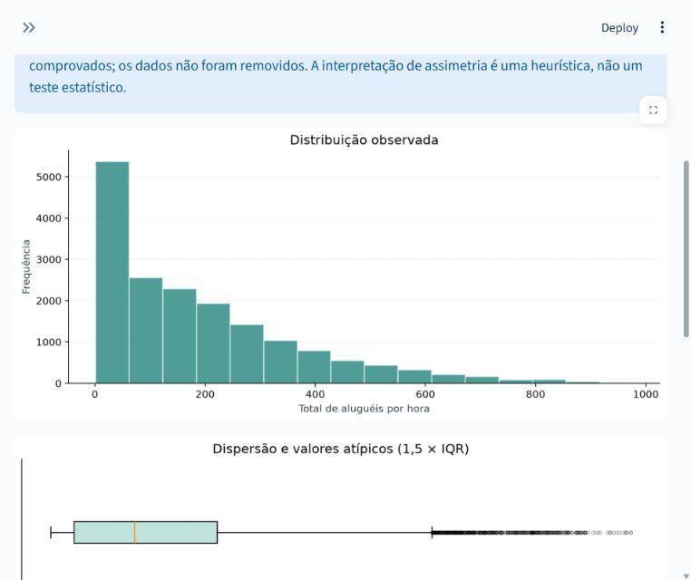
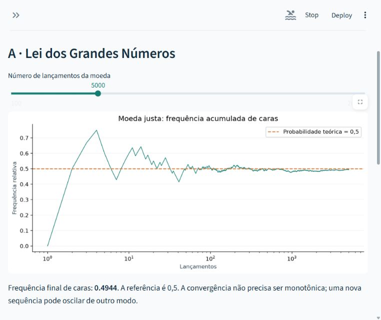
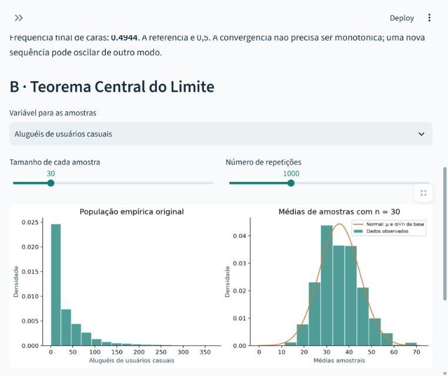
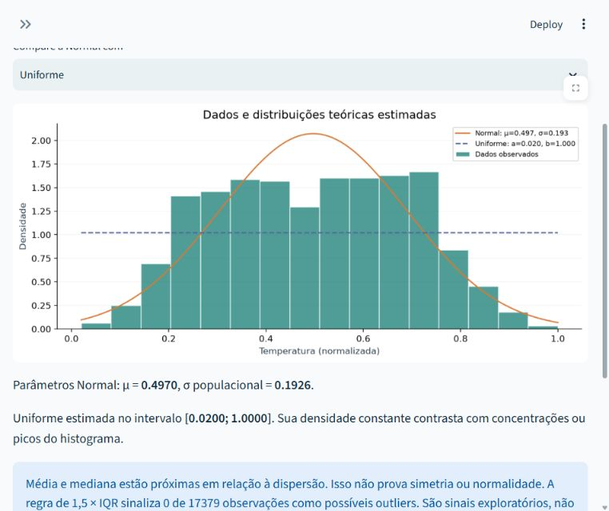
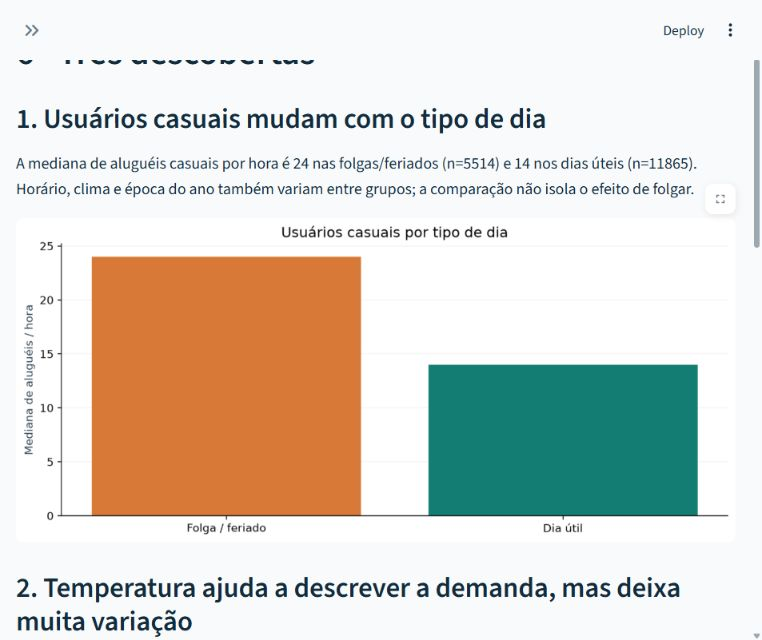
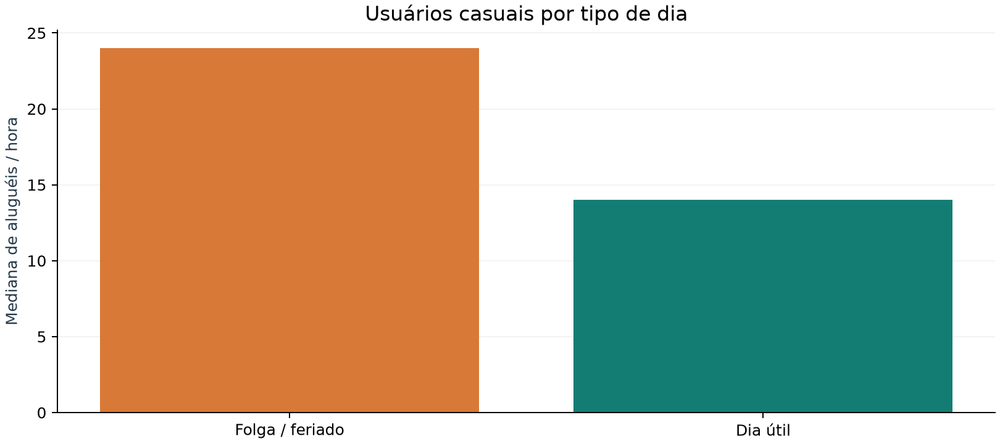
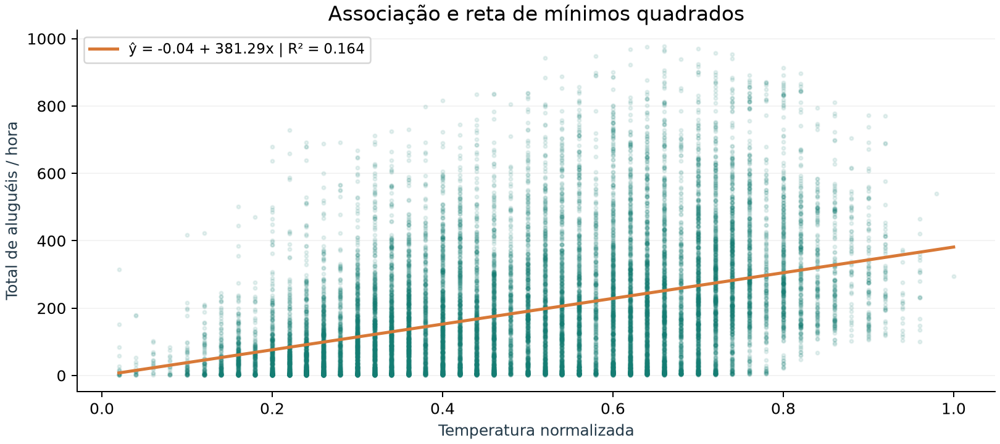
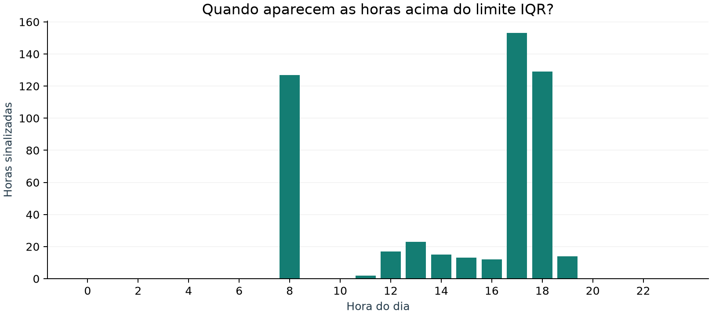

# Pedal em Dados — Relatório de sistematização

**Disciplina:** Matemática e Estatística para Computação  
**Modalidade:** projeto individual  
**Estudante:** JOAO VICTOR RAMOS MASCARENHAS
**Matrícula:** 72650059 


Se houver `PREENCHER`, o campo ainda precisa ser completado pelo estudante antes da entrega. Este relatório não atribui nomes ou matrículas presumidos.

## 1. Objetivo e organização

O projeto implementa um laboratório estatístico interativo para investigar a relação entre o contexto de uma hora e a demanda de bicicletas compartilhadas. A aplicação integra exploração descritiva, experimentos de probabilidade, comparação de distribuições e regressão linear, com um núcleo próprio verificável. O desenvolvimento e a apresentação são individuais.

O núcleo `minhastats.py` emprega Python padrão; não importa NumPy, Pandas, SciPy ou `statistics`. `dados.py` carrega e valida os registros; `graficos.py` desenha valores previamente calculados pelo núcleo; `analise.py` reúne descobertas; `app.py` oferece os sete módulos Streamlit. NumPy e SciPy são referências independentes na validação, e Pandas é utilizado para carregar, selecionar e organizar registros. Os números das descobertas abaixo são calculados por `minhastats`, incluindo frequências que dão origem às figuras.

## 2. Dataset, escolha e tratamento

O **Bike Sharing**, de **Hadi Fanaee-T (2013)**, contém contagens do Capital Bikeshare em Washington, D.C., associadas a meteorologia e calendário em 2011–2012. Foi escolhida a versão horária `hour.csv`, que permite comparar tipos de dia e horários de alta demanda. A fonte é o [UCI Machine Learning Repository](https://archive.ics.uci.edu/dataset/275/bike+sharing+dataset), DOI [10.24432/C5W894](https://doi.org/10.24432/C5W894), com licença [CC BY 4.0](https://creativecommons.org/licenses/by/4.0/).

A cópia analisada possui **17.379 registros e 17 colunas originais**, atendendo ao mínimo de 1.000 registros. O catálogo informa 17.389 instâncias, enquanto o CSV e seu README identificam 17.379; a análise utiliza o arquivo efetivo. Há **7 variáveis numéricas** nos seletores e **4 categóricas**, derivadas dos códigos originais.

As variáveis numéricas são temperatura, sensação térmica, umidade e vento normalizados, além das contagens `casual`, `registered` e `cnt`. As categóricas são clima, tipo de dia, ano e feriado. O identificador, a data e códigos numéricos de categorias ficam fora do seletor contínuo. `cnt = casual + registered`; uma associação entre parte e total é estrutural e não constitui evidência causal.

O CSV foi preservado integralmente; a leitura apenas acrescenta rótulos e interpreta a data. Nenhum registro foi excluído ou imputado. Horas ausentes não foram transformadas em zeros, e valores sinalizados pelo IQR foram mantidos. A validação rejeita registros inconsistentes, em vez de corrigir silenciosamente a base. O conjunto de verificações inclui esquema, número de linhas, nulos, finitude, domínios, contagens inteiras não negativas, soma dos tipos de usuário, unicidade e coerência de datas.

Há divergências entre o catálogo e o README sobre a normalização da temperatura e os nomes associados às estações. Por isso, as medidas meteorológicas permanecem na escala normalizada original; não se atribuem °C aos seus valores. O código `season` é preservado, mas não traduzido nem usado nos seletores. O dicionário, as decisões e a atribuição completa estão em [dados/FONTE.md](dados/FONTE.md).

**Integridade da cópia:** SHA-256 do CSV `e03de4ee4ef4dc376ac6e04bf829673c6269e8eba5c60fa121640fa2f829504f`. O manifesto [dados/metadados.json](dados/metadados.json) registra origem, momento de obtenção e hashes. Um hash permite verificar igualdade de arquivos; isoladamente não comprova sua procedência.

## 3. Núcleo estatístico e decisões matemáticas

As funções validam entradas vazias, valores não numéricos/não finitos e parâmetros inválidos. Medidas indefinidas produzem erro explícito; no resumo, valores amostrais/CV indefinidos são apresentados como indisponíveis. Somas usam `math.fsum` para reduzir erro de arredondamento, sem substituir as fórmulas por chamadas estatísticas prontas.

### Tendência central e posição

Para as observações $x_1,\ldots,x_n$, seja $x_{(1)}\leq\cdots\leq x_{(n)}$ a sequência ordenada.

$$\bar{x}=\frac{1}{n}\sum_{i=1}^{n}x_i,\qquad A=x_{(n)}-x_{(1)}.$$

A mediana é $x_{((n+1)/2)}$ quando $n$ é ímpar, e $(x_{(n/2)}+x_{(n/2+1)})/2$ quando $n$ é par.
A moda é o conjunto $M=\{v:f(v)=\max_u f(u)\}$, devolvido como lista ordenada. Empates são preservados; se todos os valores forem distintos, todos integram o empate de frequência 1, sem declarar uma moda única.

Percentis usam o método linear (tipo 7). Com índices iniciando em zero, $h=(n-1)p/100$, $j=\lfloor h\rfloor$ e $g=h-j$:

$$P_p=(1-g)x_{[j]}+g x_{[\lceil h\rceil]},\qquad Q_1=P_{25},\quad Q_2=P_{50},\quad Q_3=P_{75}.$$

Essa convenção foi escolhida para compatibilidade explícita com `numpy.percentile(method="linear")`; outros métodos podem produzir quartis diferentes. [Documentação NumPy](https://numpy.org/doc/stable/reference/generated/numpy.percentile.html).

### Dispersão, covariância e correlação

$$s^2=\frac{\sum_i(x_i-\bar{x})^2}{n-1},\qquad \sigma^2=\frac{\sum_i(x_i-\bar{x})^2}{n},\qquad s=\sqrt{s^2},\quad \sigma=\sqrt{\sigma^2}.$$

O modo amostral exige $n\geq2$; o populacional descreve a base empírica completa. Isso não significa que a base seja um censo de todos os contextos de mobilidade.

$$CV_{\text{amostral}}=100\frac{s}{|\bar{x}|},\qquad CV_{\text{populacional}}=100\frac{\sigma}{|\bar{x}|}.$$

O módulo da média é uma convenção declarada. O CV é considerado indefinido se $|\bar{x}|\leq10^{-12}\max(1,\max_i|x_i|)$; não se publica infinito ou um zero artificial. Para escalas normalizadas, o CV depende da origem da escala e deve ser interpretado com cuidado.

$$\operatorname{Cov}_{s}(X,Y)=\frac{\sum_i(x_i-\bar{x})(y_i-\bar{y})}{n-1},\qquad \operatorname{Cov}_{p}(X,Y)=\frac{\sum_i(x_i-\bar{x})(y_i-\bar{y})}{n}.$$

$$r=\frac{\sum_i(x_i-\bar{x})(y_i-\bar{y})}{\sqrt{\sum_i(x_i-\bar{x})^2}\sqrt{\sum_i(y_i-\bar{y})^2}}.$$

Vetores precisam ter o mesmo tamanho; a correlação exige pelo menos dois pares e variáveis não constantes. A implementação centraliza os dados e normaliza os desvios antes dos produtos, reduzindo problemas de escala numérica.

### Frequências, densidade e valores atípicos

O número padrão de classes é $k=\lceil1+\log_2n\rceil$ (Sturges), com largura $w=(\max x-\min x)/k$. Os intervalos são fechados à esquerda e abertos à direita; o último inclui o máximo. Uma base constante recebe um intervalo representável ao redor do valor.

$$f_j=\sum_i\mathbf{1}(x_i\in C_j),\qquad p_j=f_j/n,\qquad F_j=\sum_{\ell\leq j}f_\ell.$$

Para sobrepor uma densidade teórica, a altura de cada barra é $h_j=p_j/w_j$, de modo que $\sum_j h_jw_j=1$. Um histograma de contagens não pode ser comparado diretamente com uma PDF sem esse ajuste. Categorias usam contagens por rótulo; a ordem de apresentação não cria uma escala ordinal.

$$IQR=Q_3-Q_1,\qquad L=Q_1-1{,}5IQR,\qquad U=Q_3+1{,}5IQR.$$

Valores menores que $L$ ou maiores que $U$ são sinalizados. Os bigodes do boxplot ficam nos extremos efetivamente observados dentro desses limites, e não nos próprios limites teóricos. A classificação não comprova erro de medição. A interpretação textual utiliza $(\bar{x}-\operatorname{mediana})/\sigma$ e limiar de proximidade $0{,}1$ como heurística; não é um teste de simetria ou normalidade.

### Regressão linear por mínimos quadrados

O núcleo escolhe $b_0,b_1$ para minimizar $\sum_i(y_i-b_0-b_1x_i)^2$:

$$b_1=\frac{\sum_i(x_i-\bar{x})(y_i-\bar{y})}{\sum_i(x_i-\bar{x})^2},\qquad b_0=\bar{y}-b_1\bar{x},\qquad \widehat{y}=b_0+b_1x.$$

$$R^2=1-\frac{\sum_i(y_i-\widehat{y}_i)^2}{\sum_i(y_i-\bar{y})^2}.$$

O cálculo dos resíduos é feito na forma centrada equivalente. $X$ e $Y$ constantes são rejeitados, porque a inclinação ou o denominador de $R^2$ seriam indefinidos. Na regressão simples com intercepto, $R^2=r^2$, identidade usada na referência de validação. A comparação externa utiliza [SciPy linregress](https://docs.scipy.org/doc/scipy/reference/generated/scipy.stats.linregress.html).

### Densidades teóricas

$$f_N(x)=\frac{1}{\sigma\sqrt{2\pi}}\exp\!\left[-\frac{1}{2}\left(\frac{x-\mu}{\sigma}\right)^2\right],\quad x\in\mathbb{R},\quad\sigma>0.$$

$$f_U(x)=\begin{cases}\frac{1}{b-a},&a\leq x\leq b\\0,&\text{caso contrário},\end{cases}\qquad a<b.$$

$$f_E(x)=\begin{cases}\lambda e^{-\lambda x},&x\geq0\\0,&x<0,\end{cases}\qquad\lambda>0.$$

A Normal usa $\widehat\mu=\bar{x}$ e $\widehat\sigma=\sqrt{\sum_i(x_i-\bar{x})^2/n}$. A Uniforme usa $a=\min x$, $b=\max x$. A Exponencial sem deslocamento usa $\widehat\lambda=1/\bar{x}$ e só é oferecida para observações não negativas com média positiva. Esses ajustes simples permitem comparação exploratória, sem declarar que o modelo seja verdadeiro.

### Lei dos Grandes Números e Teorema Central do Limite

Na experiência da moeda, $X_i\sim\operatorname{Bernoulli}(0{,}5)$ independentes e $S_n=\sum_iX_i$:

$$\frac{S_n}{n}\xrightarrow[]{P}0{,}5.$$

A LGN descreve aproximação com o crescimento de $n$, não aproximação monotônica em toda trajetória finita. No TCL, sorteios independentes com reposição da distribuição empírica produzem médias $\bar{X}_n$:

$$\frac{\sqrt n(\bar{X}_n-\mu)}{\sigma}\xrightarrow[]{d}\mathcal N(0,1),\qquad \operatorname{DP}(\bar{X}_n)=\frac{\sigma}{\sqrt n}.$$

Cada repetição usa uma nova amostra. A média empírica finita e sua variância fornecem os parâmetros de referência; aumentar o número de repetições melhora a aproximação do histograma simulado, enquanto aumentar o tamanho de cada amostra altera a distribuição das médias. São controles com papéis diferentes.


## 4. Validação reproduzível

O comando `python scripts/gerar_resultados.py` calculou **209 comparações aprovadas**, envolvendo **9.549 componentes numéricos**. A comparação é componente a componente, segundo

$$|v_{\mathrm{próprio}}-v_{\mathrm{ref}}|\leq10^{-10}+10^{-9}|v_{\mathrm{ref}}|.$$

A maior diferença absoluta observada entre todos os componentes foi **7.275958e-12**. Esse máximo considera medidas em escalas diferentes; o aceite sempre usa a tolerância aplicada ao valor de referência de cada componente. A evidência completa, com função, dados, referência, valores, erro e tolerância, está em [docs/validacao.csv](docs/validacao.csv). Para vetores longos, o CSV resume a exibição, mas compara todos os componentes e registra sua quantidade.

As sete variáveis reais são verificadas para média, mediana, todas as modas, amplitude, percentis, quartis, variâncias, desvios, CV, resumo, frequências e IQR. O par temperatura–demanda verifica covariâncias, Pearson e regressão. Também se verificam frequências categóricas, densidades e trajetórias simuladas. Na validação das simulações, a referência utiliza exatamente os mesmos sorteios e calcula frequências/médias com NumPy; isso verifica o cálculo, sem ser uma prova empírica dos teoremas.

**Convenção da moda:** `scipy.stats.mode` devolve uma única moda; por isso sua comparação direta é feita no caso unimodal `[1,2,2,3]`. Empates, como `[1,1,2,2]`, são comparados ao conjunto de valores de frequência máxima obtido com `numpy.unique`. [Documentação SciPy mode](https://docs.scipy.org/doc/scipy/reference/generated/scipy.stats.mode.html).

Tabela resumida da execução atual (valores com até 15 algarismos significativos):

| Função / cenário | Próprio | Referência | Diferença absoluta |
|---|---:|---:|---:|
| media (cnt) | 189.463087634501 | 189.463087634501 | 0.000e+00 |
| mediana (cnt) | 142 | 142 | 0.000e+00 |
| moda (cnt) | 5 | 5 | 0.000e+00 |
| amplitude (cnt) | 976 | 976 | 0.000e+00 |
| quartis (cnt) | [40.0, 142.0, 281.0] | [40.0, 142.0, 281.0] | 0.000e+00 |
| percentil_10 (cnt) | 9 | 9 | 0.000e+00 |
| percentil_90 (cnt) | 451.200000000001 | 451.200000000001 | 0.000e+00 |
| variancia_amostral (cnt) | 32901.461104311 | 32901.4611043111 | 7.276e-12 |
| desvio_padrao_amostral (cnt) | 181.387599091865 | 181.387599091865 | 2.842e-14 |
| coeficiente_variacao_amostral (cnt) | 95.7376982274165 | 95.7376982274166 | 2.842e-14 |
| variancia_populacional (cnt) | 32899.5679308773 | 32899.5679308774 | 7.276e-12 |
| desvio_padrao_populacional (cnt) | 181.382380431169 | 181.382380431169 | 2.842e-14 |
| coeficiente_variacao_populacional (cnt) | 95.7349437802254 | 95.7349437802254 | 2.842e-14 |
| moda_unimodal_scipy (fixture unimodal [1,2,2,3]) | 2 | 2 | 0.000e+00 |
| covariancia_amostral (temp × cnt) | 14.1375996816977 | 14.1375996816977 | 5.329e-15 |
| covariancia_populacional (temp × cnt) | 14.1367861941736 | 14.1367861941736 | 7.105e-15 |
| correlacao (temp × cnt) | 0.404772275778659 | 0.404772275778658 | 1.110e-16 |
| correlacao_numpy (temp × cnt) | 0.404772275778659 | 0.404772275778659 | 2.776e-16 |
| regressao_intercepto (temp × cnt) | -0.0355961126424233 | -0.0355961126424802 | 5.684e-14 |
| regressao_inclinacao (temp × cnt) | 381.294922259175 | 381.294922259175 | 1.137e-13 |
| regressao_r2 (temp × cnt) | 0.163840595239034 | 0.163840595239035 | 1.665e-16 |

Ambiente efetivamente usado na geração: Python 3.12.14, NumPy 2.5.3 e SciPy 1.18.1. Além dessas comparações, os testes automatizados em `test_minhastats.py` cobrem amostras constantes, unitárias, vazias, assimetria, multimodalidade, média próxima de zero, deslocamentos grandes, vetores incompatíveis, bordas de intervalos, sementes e parâmetros inválidos. `test_dados.py` verifica a base real e arquivos deliberadamente corrompidos. Para executar toda a suíte: `python -m pytest -q`. O número de comparações deste relatório não é apresentado como número de casos pytest.

## 5. Módulos e evidências da interface

### Módulo 0 — Dados reais

A tela inicial apresenta dimensão da base, período, amostra de registros, dicionário e acesso ao CSV. O usuário pode verificar que as unidades observacionais são horas. A fonte original está acessível na barra lateral. Os totais exibidos correspondem ao CSV efetivamente carregado.


### Módulo 1 — Núcleo estatístico próprio

O seletor permite calcular todas as medidas de uma variável, consultar a implementação e abrir a tabela de validação. Em `cnt`, a média é 189.463088, a mediana é 142 e o desvio amostral é 181.387599 aluguéis por hora. As convenções amostral/populacional e de percentis são apresentadas explicitamente.



### Módulo 2 — Estatística descritiva interativa

Para variáveis numéricas, o módulo apresenta tendência central, dispersão, tabela de classes, histograma, boxplot e candidatos a outliers por IQR. Para categorias, apresenta barras e tabela de frequências. A interpretação automática informa o caráter heurístico da sugestão de assimetria. O agrupamento em classes também é aplicado às contagens discretas para facilitar a visualização.



### Módulo 3 — Probabilidade e Monte Carlo

A LGN usa lançamentos de moeda justa; com 5.000 lançamentos e semente 42, a frequência final de caras é **0.4944**. O TCL reamostra a variável escolhida com reposição. Para `casual`, tamanho 30, 1.000 repetições e semente 42, a média das médias é **35.827900**, contra **35.676218** na base; o desvio das médias é **9.172858**, e a referência $\sigma/\sqrt n$ é **9.001567**. Diferenças são esperadas em uma simulação finita.

O usuário controla semente, número de lançamentos, variável, tamanho amostral e repetições. Comparar tamanhos 2, 30 e 100 evidencia a mudança da forma e da dispersão das médias. A independência é construída no sorteio com reposição; ela não é pressuposta para horas consecutivas da base.





### Módulo 4 — Distribuições teóricas

A Normal está sempre sobreposta ao histograma de densidade; o usuário escolhe Uniforme ou Exponencial como segunda candidata, conforme o suporte da variável. O histograma tem área total unitária, possibilitando comparação na mesma escala das PDFs. Parâmetros são estimados pelo núcleo próprio a partir da variável escolhida.

A Normal é simétrica e tem suporte ilimitado: pode atribuir massa a valores meteorológicos fora de [0,1] ou a contagens negativas. A Uniforme tem densidade constante entre extremos observados, sendo inadequada visualmente quando há picos ou concentração central; o intervalo estimado não estabelece um limite físico. A Exponencial tem máximo em zero e queda monotônica, sendo incapaz de representar bem um pico distante de zero. Também não respeita um teto conhecido da codificação meteorológica. Compare picos, dispersão e caudas, inclusive a massa fora da faixa plotada; o gráfico mostra a faixa observada e não toda a massa das distribuições.

`casual`, `registered` e `cnt` são contagens: as três PDFs contínuas servem somente como aproximações visuais, e a altura de uma PDF não é a probabilidade de uma contagem exata. O laboratório não conclui aderência por teste formal nem seleciona um modelo apenas pela aparência. Nas variáveis limitadas e nas distribuições com assimetria, uma curva próxima em parte da faixa pode continuar sendo um modelo global ruim.



### Módulo 5 — Correlação e regressão linear

Dois seletores definem X e Y; o módulo mostra dispersão, Pearson, reta, equação e $R^2$. O campo de entrada calcula uma predição para X, com avisos de extrapolação ou de contagem negativa. Para temperatura normalizada e total, a equação ajustada é $\widehat{cnt}=-0.035596+381.294922\,temp$. Uma variação de 0,1 na temperatura normalizada corresponde a **38.1295** aluguéis por hora na reta; esse valor não pode ser interpretado como efeito de 0,1 °C.

O intercepto é o valor extrapolado da reta em X=0; sua utilidade física depende da faixa observada. A inclinação expressa associação média no ajuste, e $R^2$ é calculado na própria base. Não houve separação de treino/teste ou validação temporal de previsões.


### Módulo 6 — Relatório de descobertas

O módulo reúne três resultados descritivos sustentados por números e gráficos gerados pela aplicação, os mesmos reproduzidos na seção seguinte. O usuário pode baixar as evidências em JSON e este relatório. As afirmações mantêm as limitações de generalização e causalidade.



## 6. Três descobertas sustentadas pela base

### Descoberta 1 — Usuários casuais mudam com o tipo de dia

A mediana de aluguéis casuais por hora é 24 nas folgas/feriados (n=5514) e 14 nos dias úteis (n=11865). Horário, clima e época do ano também variam entre grupos; a comparação não isola o efeito de folgar.



As médias correspondentes são 57.4414 e 25.5613, respectivamente. A figura usa medianas, que são menos sensíveis a horas com contagens muito altas. São comparações por hora observada, não por pessoa ou por quantidade de dias. Os tamanhos diferentes dos grupos e a mistura de horários devem ser considerados antes de generalizar.

### Descoberta 2 — Temperatura ajuda a descrever a demanda, mas deixa muita variação

Temperatura normalizada e total de aluguéis têm r=0.4048. A regressão simples apresenta R²=0.1638, ou 16.4% da variação observada. O resultado é descritivo, ajustado na própria base; não mede acurácia futura nem efeito causal.



A reta explica aproximadamente 16.38% da variação de `cnt` nesta base. Horário, ano, tipo de dia e outras condições podem estar associados tanto à temperatura quanto à demanda. Não se estima o efeito causal de aquecer o ambiente, e o ajuste não demonstra capacidade de prever um período futuro.

### Descoberta 3 — Valores atípicos incluem horários plausíveis de alta demanda

A regra de 1,5 × IQR sinaliza 505 horas (2.91%) e tem limite superior 642.5 aluguéis. Dessas horas, 272 (53.9%) ocorrem às 17h ou 18h em dias úteis. Ser atípico pela regra não demonstra erro; todos os registros foram mantidos.



A figura conta as horas acima do limite superior por hora do relógio, juntando todos os tipos de dia. O percentual de pico informado no texto usa um filtro adicional: somente dias úteis às 17h ou 18h, com denominador igual ao total de horas sinalizadas. Portanto, a figura e esse percentual têm recortes explícitos diferentes. Um único limite global ignora padrões por horário; em uma análise posterior seria útil comparar referências específicas por faixa horária.


## 7. Limitações e possibilidades de continuidade

O estudo descreve um sistema específico em 2011–2012. Não se presume representatividade de outras cidades, pessoas ou da demanda atual. A unidade observacional é uma hora registrada; há dependência temporal, sazonalidade e horários ausentes. Isso impede tratar automaticamente os registros como uma amostra aleatória independente para inferência. As comparações de grupos são exploratórias e não controlam confundidores.

A regra IQR identifica extremos em relação à distribuição global, podendo sinalizar picos operacionais legítimos. As PDFs escolhidas têm limitações de suporte e forma. A regressão é simples, pode produzir previsões fisicamente impossíveis e usa todos os dados no ajuste; seu R² é descritivo, sem estimativa de desempenho futuro. Correlação não implica causalidade.

Uma continuidade possível seria incorporar hora, ano e calendário em modelos adequados a contagens e avaliá-los com divisão temporal entre ajuste e teste. Essa extensão precisaria preservar a separação entre dados usados para escolher o modelo e dados usados para avaliar previsões; ela não foi implementada neste laboratório.

## 8. Reprodução e entrega individual

Na pasta do projeto, após instalar as dependências de `requirements.txt`:

```text
python -m pytest -q
python scripts/gerar_resultados.py
python -m streamlit run app.py
```

